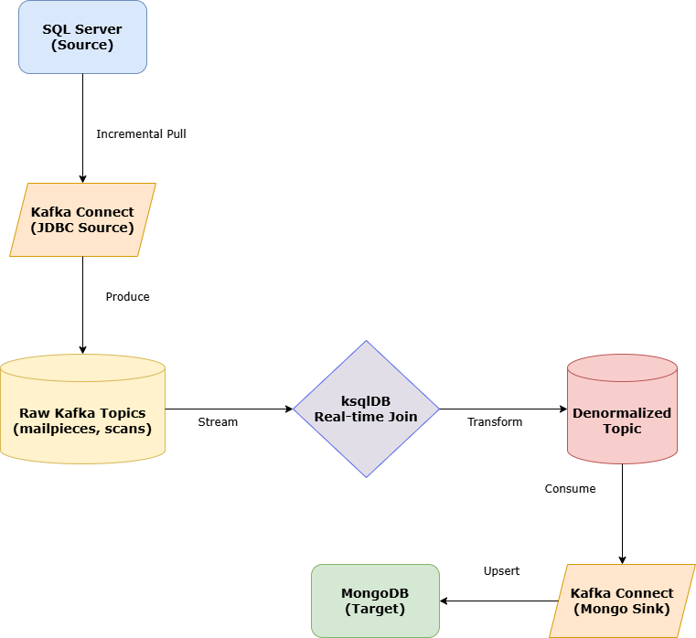

# SQL Server -> Kafka -> MongoDB migration (mailtracking)

## Overview
This project migrates data from SQL Server to MongoDB in near-real-time using Kafka Connect and ksqlDB for denormalization.

## Architecture


*Editable Diagram: [arch/migration-flow.drawio](arch/migration-flow.drawio)*

## Plan
1. **Prepare SQL Server**
   - Add indexes for incremental pulls (see [sql/indexes.sql](sql/indexes.sql)).
   - Split address fields and added SLA/start dates for better tracking.
2. **Kafka Connect (Ingest)**
   - Use JDBC Source for SQL Server to pull `mailpieces` and `delivery_scans`.
3. **ksqlDB (Process)**
   - Join `mailpieces` and `delivery_scans` into a single denormalized stream based on the Intelligent Mail Barcode (`imb`).
   - Transform flat address fields into a nested `address` object.
   - Aggregate scans and calculate summary fields like `latest_status`.
4. **Kafka Connect (Sink)**
   - Use MongoDB Kafka Sink to write the denormalized documents into the `mailpieces_with_scans` collection.
5. **Validation**
   - Compare counts (e.g., 70% Delivered, 15% Returned, 10% Forwarded, 5% No Scans) and verify document structure in MongoDB.

## Assumptions
- Near-real-time migration via Change Tracking/Incremental polling.
- `mailpiece_id` and `delivery_scan_id` are monotonically increasing.
- **90-Day Retention**: MongoDB documents are automatically deleted after 90 days via TTL index on `statement_gen_date`.
- **Deletes in SQL Server are NOT reflected in MongoDB** (due to JDBC `incrementing` mode).

## Automated Setup
You can perform all setup steps (Folder creation, Infrastructure, Database Init, Connector Registration) using the provided scripts:

**PowerShell (Windows):**
```powershell
./setup.ps1
```

**Bash (Linux/macOS/WSL):**
```bash
# If using Podman and the service is not running, initialize the socket:
podman system service -t 0 unix:///tmp/podman.sock &
export DOCKER_HOST=unix:///tmp/podman.sock
chmod +x setup.sh
./setup.sh
```

## 1) Start Infrastructure
1. Create a `.env` file in the root directory:
   ```env
   MSSQL_PASSWORD=YourStrong!Passw0rd
   ```
2. Run the following from the root folder (supports Docker or Podman):
   ```bash
   podman compose up -d
   ```

### Service Inventory
| Service | Role | Port | Description |
| :--- | :--- | :--- | :--- |
| **SQL Server** | Source Database | 1433 | Stores relational mailpiece and scan data. |
| **MongoDB** | Target Database | 27017 | Stores denormalized document records. |
| **Kafka** | Message Backbone | 9092 | Facilitates data movement between services. |
| **Kafka Connect** | Connector Host | 8083 | Runs the JDBC Source and MongoDB Sink. |
| **ksqlDB** | Transformation Engine | 8088 | Performs real-time joining and denormalization. |

## 2) Register Connectors
Register the source and sink connectors.

### Using PowerShell (Windows)
```powershell
# Load .env variables into environment variables
Get-Content .env | Foreach-Object { $name, $value = $_.split('=', 2); [System.Environment]::SetEnvironmentVariable($name, $value, "Process") }

# Sources (with variable expansion)
(Get-Content connectors/sqlserver-jdbc-source-mailpieces.json -Raw) | % { $ExecutionContext.InvokeCommand.ExpandString($_) } | curl.exe -X POST http://localhost:8083/connectors -H "Content-Type: application/json" -d @-
(Get-Content connectors/sqlserver-jdbc-source-delivery_scans.json -Raw) | % { $ExecutionContext.InvokeCommand.ExpandString($_) } | curl.exe -X POST http://localhost:8083/connectors -H "Content-Type: application/json" -d @-

# Sinks
curl.exe -X POST http://localhost:8083/connectors -H "Content-Type: application/json" --data-binary "@connectors/mongodb-sink-denormalized.json"
```

### Using Bash (Linux/macOS/WSL)
```bash
# Load variables
source .env

# Sources (Note: JSON files use PowerShell '${env:VAR}' syntax)
cat connectors/sqlserver-jdbc-source-mailpieces.json | sed 's/\${env:/\${/g' | envsubst | curl.exe -X POST http://localhost:8083/connectors -H "Content-Type: application/json" -d @-
cat connectors/sqlserver-jdbc-source-delivery_scans.json | sed 's/\${env:/\${/g' | envsubst | curl.exe -X POST http://localhost:8083/connectors -H "Content-Type: application/json" -d @-

# Sinks
curl.exe -X POST http://localhost:8083/connectors -H "Content-Type: application/json" --data-binary "@connectors/mongodb-sink-denormalized.json"
```

**Connector Definitions:**
- [sqlserver-jdbc-source-mailpieces.json](connectors/sqlserver-jdbc-source-mailpieces.json)
- [sqlserver-jdbc-source-delivery_scans.json](connectors/sqlserver-jdbc-source-delivery_scans.json)
- [mongodb-sink-denormalized.json](connectors/mongodb-sink-denormalized.json) (Primary denormalized sink)
- [mongodb-sink-mailpieces.json](connectors/mongodb-sink-mailpieces.json) (Optional individual collection)
- [mongodb-sink-delivery_scans.json](connectors/mongodb-sink-delivery_scans.json) (Optional individual collection)

## 3) Database Initialization
Run these commands to initialize the database and seed sample data:
```powershell
# Initialize Database (Mandatory)
Get-Content -Raw .\sql\init-db.sql | podman exec -i mongodb-migration-sqlserver-1 sqlcmd -S localhost -U sa -P "$env:MSSQL_PASSWORD" -C -d master

# Testing the new database
podman exec -i mongodb-migration-sqlserver-1 sqlcmd -S localhost -U sa -P "$env:MSSQL_PASSWORD" -C -d mailtracking -Q "select getdate()"

# Apply Schema (Mandatory)
Get-Content -Raw .\sql\schema.sql | podman exec -i mongodb-migration-sqlserver-1 sqlcmd -S localhost -U sa -P "$env:MSSQL_PASSWORD" -C -d master

# Create indexes (Mandatory)
Get-Content -Raw .\sql\indexes.sql | podman exec -i mongodb-migration-sqlserver-1 sqlcmd -S localhost -U sa -P "$env:MSSQL_PASSWORD" -C -d master
```

## 4) ksqlDB Denormalization
The ksqlDB logic is automatically initialized via [ksql/init.sql](ksql/init.sql). It performs the following:
- Creates streams for source topics.
- Aggregates delivery scans into a list per `imb`.
- Performs a `LEFT JOIN` between mailpieces and the aggregated scans.
- Outputs to the `denormalized_mailpieces` topic.

## 5) Verification Commands
**SQL Server (PowerShell):**
```bash
podman exec -it mongodb-migration-sqlserver-1 sqlcmd -S localhost -U sa -P "$env:MSSQL_PASSWORD" -C -Q "SELECT TOP 5 * FROM mailtracking.dbo.mailpieces ORDER BY mailpiece_id DESC;"
```

**MongoDB:**
```bash
podman exec -it mongodb-migration-mongodb-1 mongosh mailtracking --eval "db.mailpieces_with_scans.find().pretty()"
```

## 6) Debugging & Diagnostics

**Check ksqlDB initialization logs:**
```bash
podman logs ksql-setup
```

**Verify KSQL Streams and Tables:**
```bash
podman exec -it ksqldb-cli ksql -e "SHOW STREAMS; SHOW TABLES;" http://ksqldb-server:8088
```

**Check Kafka Connect Status:**
```bash
# List all connectors
curl.exe http://localhost:8083/connectors

# Check specific status
curl.exe http://localhost:8083/connectors/sqlserver-mailtracking-source/status
curl.exe http://localhost:8083/connectors/sqlserver-delivery-scans-source/status
curl.exe http://localhost:8083/connectors/mongodb-denormalized-sink/status
```

**Inspect Kafka Topics:**
```bash
# Using kafka-console-consumer
podman exec -it mongodb-migration-kafka-1 kafka-console-consumer --bootstrap-server localhost:9092 --topic denormalized_mailpieces --from-beginning

# Using KSQL
podman exec -it ksqldb-cli ksql -e "PRINT 'sqlserver-mailpieces' FROM BEGINNING LIMIT 5;" http://ksqldb-server:8088
```

**Interactive MongoDB Shell:**
```bash
podman exec -it mongodb-migration-mongodb-1 mongosh mailtracking
```

**Interactive SQL Server Shell (PowerShell):**
```bash
podman exec -it mongodb-migration-sqlserver-1 sqlcmd -S localhost -U sa -P "$env:MSSQL_PASSWORD" -C
```

## Notes & Limitations
- **No Hard Deletes**: The JDBC Source Connector in `incrementing` mode does not detect row deletions.
- **Updates**: Updates to existing rows in SQL Server are only captured if a `timestamp` column is used (currently configured for `incrementing` ID only).
- **Schema**: Ensure `ksql/init.sql` schema matches the SQL Server table definitions exactly.

## 7) Full Data Flow Test (Step-by-Step)

Follow these steps to verify the entire pipeline from SQL Server to MongoDB.

### Step 1: Insert Sample Data into SQL Server
```powershell
podman exec -it mongodb-migration-sqlserver-1 sqlcmd -S localhost -U sa -P "$env:MSSQL_PASSWORD" -C -Q "INSERT INTO mailtracking.dbo.mailpieces (cust_id, name, address_line_1, address_line_2, city, state, zip_code, imb, statement_gen_date) VALUES (999, 'Test User', '123 Main St', 'Apt 4B', 'Springfield', 'IL', '62704', '0070012345688888888881234567890', GETUTCDATE());"
podman exec -it mongodb-migration-sqlserver-1 sqlcmd -S localhost -U sa -P "$env:MSSQL_PASSWORD" -C -Q "INSERT INTO mailtracking.dbo.delivery_scans (imb, scan_datetime, scan_zipcode, delivery_status, is_returned, is_forwarded) VALUES ('0070012345688888888881234567890', GETUTCDATE(), '62704', 'IN_TRANSIT', 0, 0);"
```
If bulk data insert needs to be tested, use the sample seed like below:
```Powershell
# Add sample data (Optional. For testing only)
Get-Content -Raw .\sql\seed_sample_data.sql | podman exec -i mongodb-migration-sqlserver-1 sqlcmd -S localhost -U sa -P "$env:MSSQL_PASSWORD" -C -d master
```

### Step 2: Verify Data in Kafka Topics
Check if the raw data reached Kafka:
```powershell
podman exec -it mongodb-migration-kafka-1 kafka-console-consumer --bootstrap-server localhost:9092 --topic sqlserver-mailpieces --from-beginning --max-messages 1
```

### Step 3: Verify ksqlDB Processing
Check if the denormalized join is working by running ksqlDB interactively:
1. Enter the ksqlDB CLI:
   ```bash
   podman exec -it ksqldb-cli ksql http://ksqldb-server:8088
   ```
2. Run the following query (Identifiers like `"imb"` are case-sensitive and must be quoted):
   ```sql
   SELECT * FROM DENORMALIZED_MAILPIECES WHERE "imb" = '0070012345688888888881234567890' EMIT CHANGES LIMIT 1;
   ```
   *Type `exit` to leave the CLI when done.*

### Step 4: Verify Final Document in MongoDB
Verify the final denormalized document with nested scans and structured address:
```bash
podman exec -it mongodb-migration-mongodb-1 mongosh mailtracking --eval "db.mailpieces_with_scans.find({imb: '0070012345688888888881234567890'}).pretty()"
```

## Data Distribution (Sample Seed)
The `seed_sample_data.sql` script creates a weighted distribution of 100 mailpieces:
- **70% Delivered**: 3-7 scans per piece.
- **15% Returned**: 5-9 scans per piece, ending in `RETURN_DELIVERED`.
- **10% Forwarded**: 5-9 scans per piece, ending in `FORWARD_DELIVERED`.
- **5% No Scans**: Only the mailpiece record is created.

## MongoDB Document Schema
The final document in MongoDB has the following structure:
```json
{
  "mailpiece_id": 1,
  "imb": "0070012345600000000106202109999",
  "address": {
    "address_line_1": "1 Main St",
    "address_line_2": null,
    "city": "Springfield",
    "state": "IL",
    "zip_code": "62704"
  },
  "latest_status": "DELIVERED",
  "latest_scan_datetime": 1769781438000,
  "scans": [
    { "delivery_status": "IN_TRANSIT", ... },
    { "delivery_status": "DELIVERED", ... }
  ],
  "statement_gen_date": 1769723838000
}
```
